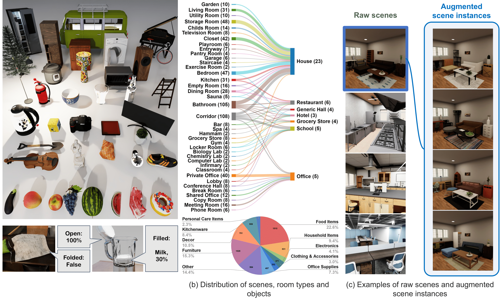

# Behavior Vision Suite

<div align="center">
<strong><h3><a href="???">BEHAVIOR Vision Suite: Customizable Dataset Generation via Simulation</a></h3></strong>
</div>
<div align="center">
    <span><a href="https://gyhandy.github.io/"><strong>Yunhao Ge</strong></a>*,&nbsp;&nbsp;</span>
    <span><a href="https://www.linkedin.com/in/yihetang/"><strong>Yihe Tang</strong></a>*,&nbsp;&nbsp;</span>
    <span><a href="https://cnut1648.github.io/"><strong>Jiashu Xu</strong></a>*,&nbsp;&nbsp;</span>
    <span><a href="https://www.cemgokmen.com/"><strong>Cem Gokmen</strong></a>*,&nbsp;&nbsp;</span><br/>
    <span><a href="https://www.chengshuli.me/"><strong>Chengshu Li</strong></a>,&nbsp;&nbsp;</span>
    <span><a href="https://wensi-ai.github.io/"><strong>Wensi Ai</strong></a>,&nbsp;&nbsp;</span>
    <span><a href="https://web.stanford.edu/~benjm/"><strong>Benjamin Jose Martinez</strong></a>,&nbsp;&nbsp;</span>
    <span><a href="https://www.linkedin.com/in/arman-aydin-915035185/"><strong>Arman Aydin</strong></a>,&nbsp;&nbsp;</span>
    <span><a href="https://www.linkedin.com/in/mona-anvari/"><strong>Mona Anvari</strong></a>,&nbsp;&nbsp;</span>
    <span><a href="https://scholar.google.ca/citations?user=u4S8E4UAAAAJ&hl=en"><strong>Ayush K Chakravarthy</strong></a>,&nbsp;&nbsp;</span>
    <span><a href="https://kovenyu.com/"><strong>Hong-Xing Yu</strong></a>,&nbsp;&nbsp;</span>
    <span><a href="https://jdw.ong/"><strong>Josiah Wong</strong></a>,&nbsp;&nbsp;</span>
    <span><a href="https://scholar.google.com/citations?user=sqTh_dwAAAAJ&hl=en"><strong>Sanjana Srivastava</strong></a>,&nbsp;&nbsp;</span>
    <span><a href="https://scholar.google.com/citations?hl=en&user=jGwt3mcAAAAJ&view_op=list_works&sortby=pubdate"><strong>Sharon Lee</strong></a>,&nbsp;&nbsp;</span>
    <span><a href="https://scholar.google.com/citations?user=QRvXHNsAAAAJ&hl=en"><strong>Shengxin Zha</strong></a>,&nbsp;&nbsp;</span>
    <span><a href="http://ilab.usc.edu/itti/"><strong>Laurent Itti</strong></a>,&nbsp;&nbsp;</span>
    <span><a href="https://yunzhuli.github.io/"><strong>Yunzhu Li</strong></a>,&nbsp;&nbsp;</span>
    <span><a href="https://robertomartinmartin.com/"><strong>Roberto Martín-Martín</strong></a>,&nbsp;&nbsp;</span>
    <span><a href="https://aptx4869lm.github.io/"><strong>Miao Liu</strong></a>,&nbsp;&nbsp;</span>
    <span><a href="https://pzzhang.github.io/pzzhang/"><strong>Pengchuan Zhang</strong></a>,&nbsp;&nbsp;</span>
    <span><a href="https://ai.stanford.edu/~zharu/"><strong>Ruohan Zhang</strong></a>,&nbsp;&nbsp;</span>
    <span><a href="https://profiles.stanford.edu/fei-fei-li"><strong>Li Fei-Fei</strong></a>,&nbsp;&nbsp;</span>
    <span><a href="https://jiajunwu.com/"><strong>Jiajun Wu</strong></a></span>
</div>
<br/>
<div align="center">
    <span>Stanford&nbsp;&nbsp;</span>
    <span>USC&nbsp;&nbsp;</span>
    <span>Harvard&nbsp;&nbsp;</span>
    <span>Meta&nbsp;&nbsp;</span>
    <span>UT Austin&nbsp;&nbsp;</span>
    <span>UIUC</span>
</div>
<br/>
<div align="center">
    <span>CVPR 2024&nbsp;&nbsp;&nbsp;&nbsp;</span>
    <span><a href="https://behavior-vision-suite.github.io/">Project Page</a></span>
</div>

# Overview
We introduce BEHAVIOR Vision Suite (BVS), our proposed toolkit for computer vision research. BVS builds upon the extended object assets and scene instances from BEHAVIOR-1K, and provides a customizable data generator that allows users to generate photorealistic, physically plausible labeled data in a controlled manner. We demonstrate BVS with three representative applications.


## Installation

Our code depends on [Omnigibson](https://behavior.stanford.edu/omnigibson/index.html). Users can refer to their [installation guide](https://behavior.stanford.edu/omnigibson/getting_started/installation.html).


Other than Omnigibson, user also need to install:
```shell
pip install fire
```


## Extended B1K Assets
Covering a wide range of object categories and scene types, our 3D assets have high visual and physical fidelity and rich annotations of semantic properties, allowing us to generate 1,000+ realistic scene configurations.

We show the examples of 3D objects and semantic properties they support in the below left figure; and distributions of scenes, room types and objects in the below right figure.
<div align="center">


</div>

These extended assets will be [merged into the Behavior datasets](https://behavior.stanford.edu/knowledgebase/objects/index.html) and released soon.

## Scene Instance Augmentation
We enable the generation of diverse scene variations by altering furniture object models and incorporating additional everyday objects. Specifically, it can swap scene objects with alternative models from the same category, which are grouped based on visual and functional similarities. This randomization significantly varies scene appearances while maintaining layouts’ semantic integrity.


https://github.com/behavior-vision-suite/behavior-vision-suite.github.io/assets/37067883/ef19b475-db60-408b-b18f-83527fa9360a

### How to augment a scene
We provide the script for users to automatically generate augmented scene via object insertion and model replacement by:
```python
# this will save augmented in the output_root (default is "output_data/aug_scene.json")
python augment_scene.py
```
Additional arguments are:
```python
--scene_id(int) # Id for raw scene to create. Default is 0.
--num_insert(int) # Number of additional objects to be inserted. Default is 5. Set to 0 if don't want to insert new objects.
--replace_ratio(float) # Probability each object got replaced by a new model. Default is 0.2. Set to 0. if don't want to replace object models.
--save_json_name(str) # Json file name to save the scene file for augmented scene. Default is aug_scene.json.
```


# Applications
As showcases of what BVS can support, we show three key applications, which are detailed as follows.


## Holistic Scene Understanding
One of the major advantages of synthetic datasets, including BVS, is that they offer various types of labels (segmentation masks, depth maps, and bounding boxes) for the same sets of input images. We believe that this feature can fuel the development of versatile vision models that can perform multiple perception tasks at the same time in the future.

We generated extensive traversal videos across representative scenes, each with 10+ camera trajectories.For each image, BVS generates various labels (e.g., scene graphs, segmentation masks, depth).


https://github.com/behavior-vision-suite/behavior-vision-suite.github.io/assets/37067883/9c0bfdbc-13d5-4e9f-b37e-e40ed8662bcd

### How to sample a trajectory

Omnigibson provides a series of scenes. For a given `scene_id`, we can sample a trajectory by:
```python
# this will save in the output_root (default is "output_data")
python sample_fps.py --scene_id=<scene_id>

# this will save the trajectory poses in the output_root (default is "output_data/fps/poses.npy")
# also save the rendered video in output_root (default is "output_data/fps/video.mp4)
python collect_data.py --scene_id=<scene_id>

# this will sample trajectory in the augmented scene instance you generated before:
python collect_data.py --scene_id=<scene_id> --scene_file=<path to your saved json scene file>
```

## Parametric Model Evaluation
Parametric model evaluation is essential for developing and understanding perception models, enabling a systematic assessment of performance robustness against various domain shifts. Leveraging the flexibility of the simulator, our generator extends parametric evaluation to more diverse axes, including scene, camera, and object state changes.

Below we show the model prediction for Articulation, Visibility, Lighting, Zoom and Pitch axis respectively.


https://github.com/behavior-vision-suite/behavior-vision-suite.github.io/assets/37067883/46b0402c-b034-4b2e-95f2-fadc067f4087


https://github.com/behavior-vision-suite/behavior-vision-suite.github.io/assets/37067883/9cdb9bf8-8c59-47c0-88fb-7cc698c591b8


https://github.com/behavior-vision-suite/behavior-vision-suite.github.io/assets/37067883/b4b5ccde-8526-4eb3-a2cf-d95ea00c9a65


https://github.com/behavior-vision-suite/behavior-vision-suite.github.io/assets/37067883/db531693-f07e-4466-a5c3-88e808812f97


https://github.com/behavior-vision-suite/behavior-vision-suite.github.io/assets/37067883/b87542d5-8bc0-4e86-94af-757360dca508


## Object States and Relations Prediction
Users can also leverage BVS to generate training data with specific object configurations that are difficult to accumulate or annotate in the real world. We illustrates BVS’s practical application in synthesizing a dataset that facilitates the training of a vision model capable of zero-shot transfer to real-world images on the task of object relationship prediction.


https://github.com/behavior-vision-suite/behavior-vision-suite.github.io/assets/37067883/b5a3db48-4cab-47e8-80f7-b34622904612


# Citation
If you find our project helpful, please cite our paper:
```bibtex
```
